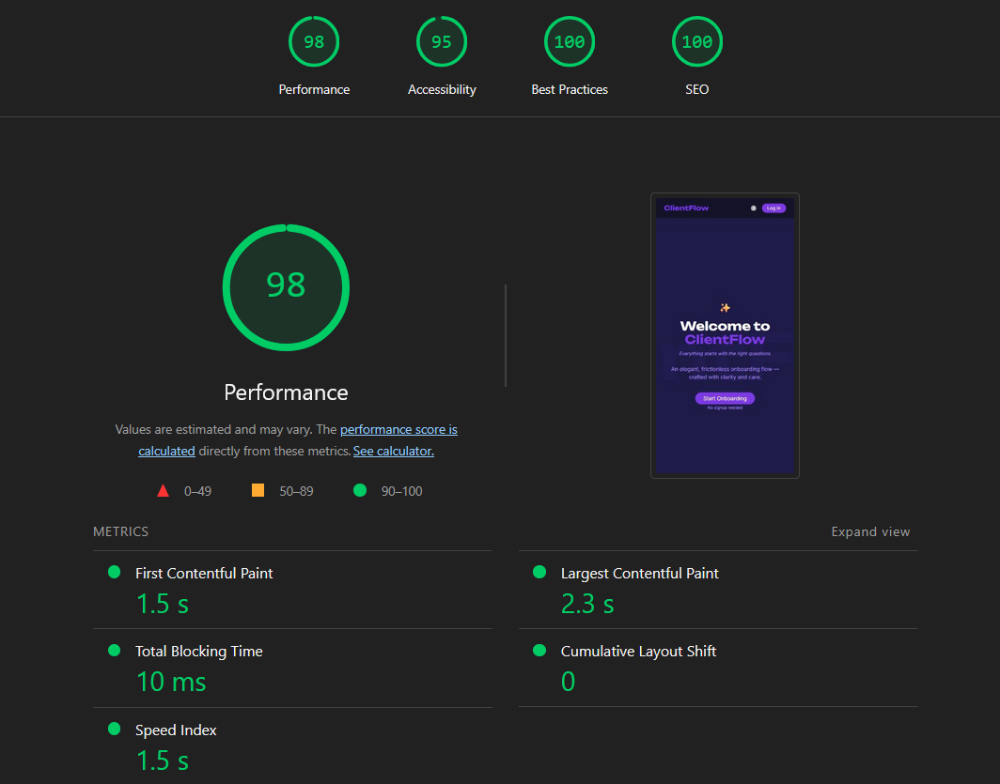
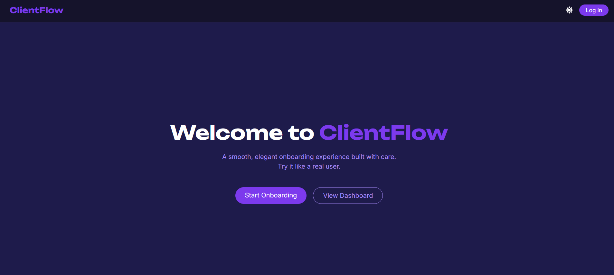
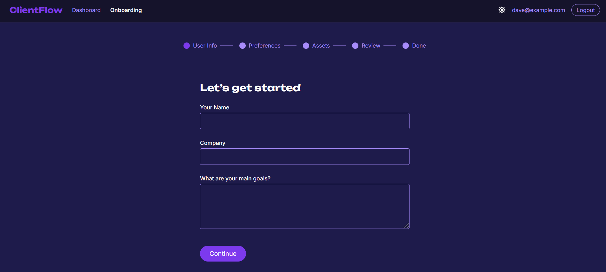
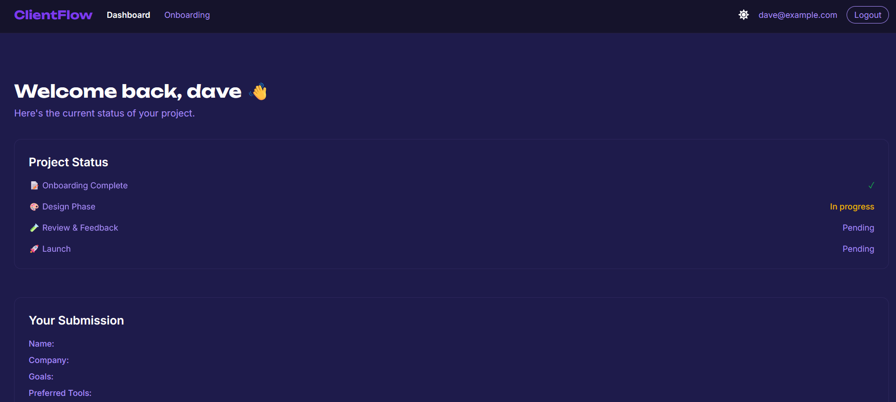

# ClientFlow — Minimal Onboarding Flow for Agencies


> _Smooth client onboarding, no friction. Just clarity, flow — and faster projects._

---

## 🧭 About ClientFlow

**ClientFlow** is a sleek, no-nonsense onboarding app designed to simplify how digital agencies and freelancers gather initial information from clients.

With a smooth, multi-step form flow and persistent state, it helps teams:

- 📥 Collect user and company details
- 🧭 Understand project goals, tools, and availability
- 📁 Upload relevant assets for faster kickoff
- 🌒 Adapt to user theme preferences (light/dark)
- 💾 Persist data locally for session continuity

Built with **React**, **Zustand**, **Zod**, and **Tailwind CSS**, it’s fast, minimal, and production-ready.

---

## 🚀 Live Preview

👉 https://clientflow.quimromero.com

---

## ✨ Features

- ✅ Multi-step onboarding flow with persistent progress
- ✍️ Collects user name, company, goals, preferences, and files
- 🧠 Zod-powered form validation (via `react-hook-form`)
- 📁 Asset upload with file metadata (name, size, type)
- 🌓 Light/Dark mode toggle with localStorage memory
- 🧱 Responsive design with smooth transitions (Framer Motion)
- 🧪 Cypress E2E + **axe-core accessibility audits** (serious/critical)
- 🔒 Route guards for authenticated sections (Login → Onboarding → Dashboard)
- 💾 State persistence via Zustand `persist` (`clientflow-onboarding` key)

---

## 🧠 Tech Stack

| Tech                           | Role                              |
| ------------------------------ | --------------------------------- |
| **React + TypeScript**         | Core frontend framework           |
| **Vite**                       | Build tool and local dev server   |
| **Tailwind CSS**               | Design system and theming         |
| **Framer Motion**              | Animations and transitions        |
| **Zustand**                    | Global state and onboarding steps |
| **React Hook Form + Zod**      | Form logic + schema validation    |
| **React Router**               | Routing between views             |
| **ESLint + typescript-eslint** | Linting and code quality          |
| **Cypress**                    | End-to-end testing                |
| **axe-core + cypress-axe**     | Accessibility audits inside E2E   |

---

## 🗂 Project Structure

- `src/`
  - `pages/` – Home, Login, Onboarding, Dashboard
  - `components/` – Navbar, Footer, StepIndicator, etc.
  - `features/onboarding/` – Steps 1–5
  - `store/` – Zustand store with persisted onboarding data
  - `hooks/` – Theme and app utilities
  - `styles/` – Tailwind base and globals
- `public/` – Favicon, fonts, metadata
- `index.html` – Root HTML
- `vite.config.ts` – Vite config
- `tsconfig.*.json` – TypeScript config
- `cypress/`
  - `e2e/a11y.cy.ts` – Axe accessibility spec (home route)
  - `support/e2e.ts` – Testing Library + `cypress-axe` setup
  - `screenshots/` – Run screenshots (e.g. `a11y-home.png`)
  - `reports/a11y/` – JSON reports (e.g. `home-serious.json`)

---

## 🧪 End-to-End Testing

ClientFlow uses **Cypress** for reliable E2E testing, with each PR and push to `main` running checks via **GitHub Actions**.

**Currently tested**

- ✅ **Home** (`/`) → basic render & CTA navigation to **Login** (`/login`)
- ✅ **Login** → mock email sign-in sets a `user` and redirects to **Onboarding**
- ✅ **Onboarding flow** → Steps 1–5 validate via **Zod** + `react-hook-form`
- ✅ **Route guards** → visiting `/onboarding` or `/dashboard` without a `user` redirects to `/login`
- ✅ **Theme persistence** → toggle saves to `localStorage` and applies `documentElement.classList('dark')`
- ✅ **Asset upload** → file list renders with name and size; metadata stored in state
- ✅ **Accessibility (Axe)** → audits **serious/critical** violations on `/` (screenshot + JSON report)

**Coming soon**

- 🧭 URL-friendly step routing (deep-linking / refresh-safe)
- 📤 Export responses (JSON) + PDF/screenshot smoke checks
- ⚙️ Production build smoke tests with `vite preview`
- 🔒 Upload hardening (basic file-type restrictions)
- 📷 Inline file previews

🧪 **CI status:** https://github.com/quim-romero/clientflow/actions

---

## ♿ Accessibility & ⚡ Performance

**Accessibility**

Automated audits with **axe-core** via `cypress-axe` are wired into E2E:

- By default, we check **serious/critical** impacts on `/`
- Each run emits a **screenshot** and a **JSON report**
- You control whether the test **fails** CI on violations

**Run locally**

```bash
# Headless (ideal for CI)
npm run test:a11y

# Interactive runner
npx cypress open
```

**Artifacts**

- Screenshot → `./cypress/screenshots/a11y.cy.ts/a11y-home.png`
- JSON report (serious/critical) → `./cypress/reports/a11y/home-serious.json`

**Fail CI on violations**

In `cypress/e2e/a11y.cy.ts`, the last parameter of `cy.checkA11y(...)` controls failure:

```ts
// During cleanup/docs (does NOT fail on violations):
cy.checkA11y(undefined, undefined, callback, true);

// Enforce in CI (fails on serious/critical):
cy.checkA11y(undefined, undefined, callback, false);
```

> To extend coverage later, remove the severity filter in the callback to include **all** impacts.

**Performance**

Lighthouse (LHCI) runs against the production build.  
_Goal: keep FCP/LCP in the green on the homepage._



Generate locally:

```bash
npm run build && npm run lh:report
```

Reports are saved to `./lhci/`.

---

## 📸 Screenshots

| Home                            | Onboarding                                  | Dashboard                                 |
| ------------------------------- | ------------------------------------------- | ----------------------------------------- |
|  |  |  |

---

## 🧩 Notes

- 🛠 Built as a **demo / starter** project for client onboarding
- 🧼 Clean, accessible markup and clear visual hierarchy
- 🚫 No backend — entirely local, easy to extend with an API

---

## 📬 Contact

If you're looking for a frontend engineer to craft **clean, usable, thoughtful** onboarding flows:

- 📧 quim@quimromero.com
- 🌐 https://quimromero.com

---

> _ClientFlow helps makers move faster — by asking the right questions at the right time._
